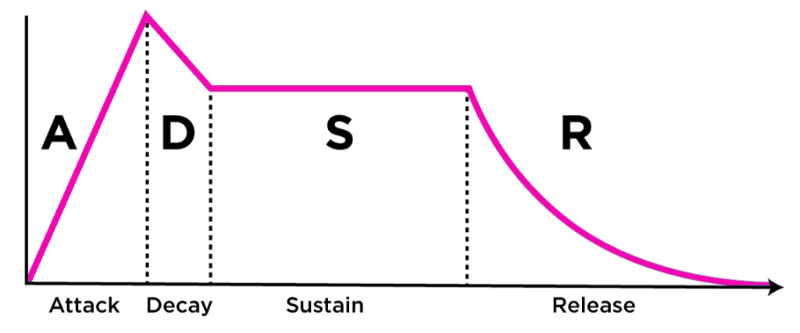
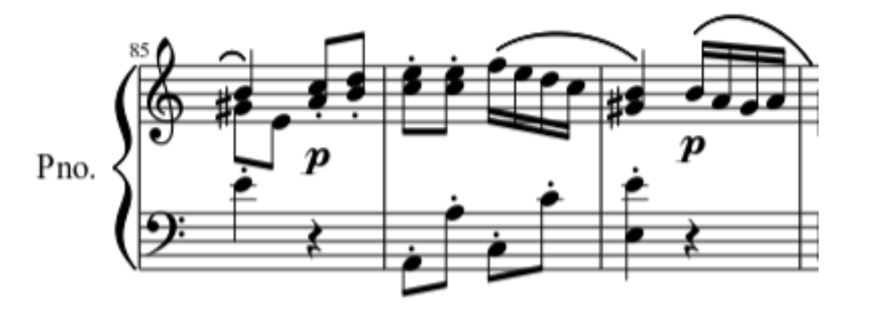
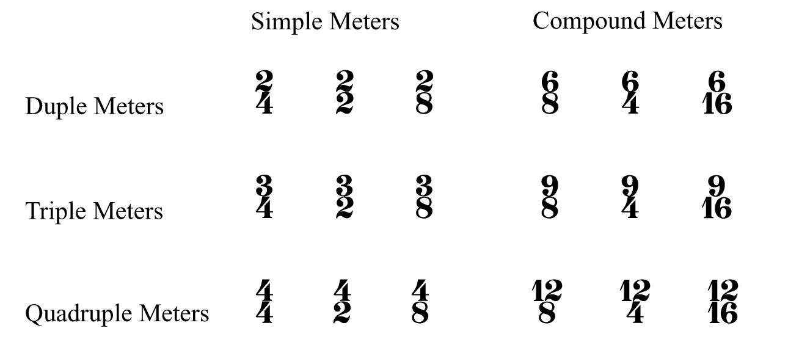

## **Acoustic**

**Acoustic** is the interdisciplinary science that deals with the study of mechanical waves in gases, liquids, and solids including vibration, sound, ultrasound, and infra-sound.

### Phase

The **phase** of a periodic function F of some real variable t (such as time) is an angle-like quantity representing the fraction of the cycle covered up to t. It is denoted phi (
t) and expressed in such a scale that it varies by one full turn as the variable t goes through each period (an F(t) goes through each complete cycle). It may be measured in any
angular unit such as degrees or radians, thus increasing by 360° or 2\pi as the variable t completes a full period.

This convention is especially appropriate for a sinusoidal function, since its value at any argument t then can be expressed as the sine of the phase phi (t), multiplied by some
factor (the amplitude of the sinusoid, the cosine may be used instead of sine, depending on where one considers each period to start).

**Phase shift**

**Phase reversal**

!!! Warning
    Two sounds in phase reversal cancel each other out.

!!! Info
    Two identical sounds were sum increasing the volume of the double

### Sound

**Sound** is a vibration (compression and rarefaction) that propagates as an acoustic wave, through a transmission medium such as a gas, liquid or solid.

Sound waves are often simplified to a description in terms of sinusoidal plane waves, which are characterized by these generic properties:

- Frequency (in Hz), or its inverse, wavelength
    - Low: 20Hz-200Hz
    - Middle-Low: 200Hz-1000Hz
    - Middle-High: 1000Hz-5000Hz
    - High: 5000Hz-20000Hz
- Amplitude, sound pressure or Intensity (dB)
- Speed of sound: the speed of sound in a particular substance was equal to the square root of the pressure acting on it multiplied the heat capacity ratio divided by its density.
  Dependent from the ambient, independent of the propagation. (~ 344 m/s)
- Direction: omnidirectional

**Reflection**

An acoustic travelling wave can be reflected by a solid surface. If a travelling wave is reflected, the reflected wave can interfere with the incident wave causing a standing wave
in the near field. The sound when impact a surface:

- one part was **absorbed**
- one part was **trasmitted**
- one part was **reflected** (both in phase and out of phase, falsifying or deleting some frequencies of the sound)

!!! Warning
    If the surface where the sound reflect opposes greater resistance than the means that leads it. The sound will be reflect in phase, otherwise in out of phase.

Principal charateristics of sound are:

1. **Pitch**: perceived as how "low" or "high" a sound is and represents the cyclic, repetitive nature of the vibrations that make up sound. For simple sounds, pitch relates to the
   frequency of the slowest vibration in the sound (called the fundamental harmonic) (Hz).
2. **Loudness**: perceived as how "loud" or "soft" a sound is and relates to the totalled number of auditory nerve stimulations over short cyclic time periods, most likely over the
   duration of theta wave cycles (dB).
3. **Duration**: perceived as how "long" or "short" a sound is and relates to onset and offset signals created by nerve responses to sounds. The duration of a sound usually lasts
   from the time the sound is first noticed until the sound is identified as having changed or ceased.

   

!!! Info 
    Transient defined means a precise variation of the amplitude.

4. **Timbre**: perceived as the quality of different sounds (e.g. the thud of a fallen rock, the whir of a drill, the tone of a musical instrument or the quality of a voice) and
   represents the pre-conscious allocation of a sonic identity to a sound.

**Harmonic**

A **Harmonic** is a wave with a frequency that is a positive integer multiple of the fundamental frequency, the frequency of the original periodic signal, such as a sinusoidal
wave. The original signal is also called the 1st harmonic (main harmonic), the other harmonics are known as higher harmonics (collateral harmonic, one or more depending on the
instrument). As all harmonics are periodic at the fundamental frequency, the sum of harmonics is also periodic at that frequency. The set of harmonics forms a harmonic series.

!!! Info
    Two notes with fundamental frequencies in a ratio equal to any integer power of two (e.g., half, twice, or four times) are perceived as very similar. Because of that, all notes with these kinds of relations can be grouped under the same pitch class.

## **Harmony**

**Harmony** is the process by which the composition of individual sounds, or superpositions of sounds, is analysed by hearing. Usually, this means simultaneously occurring
frequencies, pitches (tones, notes), or chords.

Its perception is based on consonance, pitch relationships are described as sounding more pleasant, euphonious, and beautiful than dissonant relationships which sound unpleasant,
discordant, or rough.

The study of harmony involves chords and their construction and chord progressions and the principles of connection that govern them. It refer to the "vertical" aspect of music, as
distinguished from melodic line, or the "horizontal" aspect.

Counterpoint, which refers to the relationship between melodic lines, and polyphony, which refers to the simultaneous sounding of separate independent voices, are therefore
sometimes distinguished from harmony. A dissonant chord (chord with tension) "resolves" to a consonant chord. Harmonization usually sounds pleasant to the ear when there is a
balance between consonance and dissonance. Simply put, this occurs when there is a balance between "tense" and "relaxed" moments.

### Bass writing

The Bass(Double bass) is a transposed instrument, take place on F-Clef (it is written in a octave up rather its original sound to avoid ledger lines). The four notes of the bass
are: E, A, D and G.

Rules:

Often alternate between the I (clarify and reiterate the melody) and the V.

The bass could move as follows:

1. With one chord for bar.

2. When a I is followed from a V, notes of the chord.

3. With 2 chords for bar.

4. Rest could be replaced from repeated notes.

5. Use I - V could be used instead of I - I

6. Scale notes (usually III - VII) could be used instead of I and V to create a melodic sequence.

7. When a 7 chord, or a m7 chord or a minor chord. If the fundamental goes to the V perfect, and it is followed from an IV up to the fundamental, a V diminished could be used as passing note in order to create a chromatic sequence I-V-bV-(I of IV).

!!! Info
    Bass sounds well when it is linked with the kick or in backlash.

!!! Warning
    The III and the VII doesn't sound very well on the beat instead of passing note on the upbeat (duration less or equal of an 1/8).
    
It useful to harmonise the singing note with the bass with a III or a VI.

### Chord

**Chord**, in music, is any harmonic set of pitches/frequencies consisting of multiple notes (also called "pitches") that are heard as if sounding simultaneously. For many
practical and theoretical purposes, arpeggios and broken chords (in which the notes of the chord are sounded one after the other, rather than simultaneously), or sequences of chord
tones, may also be considered as chords in the right musical context.

The most frequently encountered chords are triads, so called because they consist of three distinct notes: the root note, and intervals of a third and a fifth above the root note.

The symbols used for notating chords are:

- **m**, **min**, or **−** indicates a minor chord **(I - III Minor - V Perfect)**.
- **M**, **Ma**, **Maj**, **Δ**, or (**no symbol**) indicates a major chord. In a jazz context, this typically indicates that the player should use any suitable chord of a major
  quality, for example a major seventh chord or a 6/9 chord **(I - III Major - V Perfect)**.
- **+** or **aug** indicates an augmented chord **(I - III Augmented - V Perfect)**.
- **o** or **dim** indicates a diminished chord, either a diminished triad or a diminished seventh chord **(I - III Minor - V Diminished)**.
- **ø** indicates a half-diminished seventh chord. In some fake books, the abbreviation m7(♭5) is used as an equivalent symbol **(I - III Minor - V Diminished - VII Minor)**.
- **2** is mostly used as an extra note in a chord (e.g., add2, sus2) **(I - II Major - V Perfect)**.
- **3** is the minor or major quality of the chord and is rarely written as a number.
- **4** is mostly used as an extra note in a chord (e.g., add4, sus4) **(I - IV Perfect - V Perfect)**.
- **5** is the (perfect) fifth of the chord and is only written as a number when altered (e.g., F7(♭5)). In guitar music, like rock, a "5" indicates a power chord, which consists
  of only the root and fifth, possibly with the root doubled an octave higher.
- **6** indicates a sixth chord. There are no rules if the 6 replaces the 5th or not.
- **7** indicates a dominant seventh chord, on each degree of the scales the 7th exists (compound from 3 thirds) **(I - III - V - VII)**:
    - **Ma7/Δ**: Major chord + VII Major (III Major up)
    - **7/dom**: Major chord + VII Minor (III Minor up)
    - **m7/-**: Minor chord + VII Minor (III Minor up)
    - **m7(♭5)/ø**: Diminished chord + VII Minor (III Minor up)

!!! Note
    **Resolution of the dominant VII chord**

    - complete: Bass VII - and Violin (any of the 3 positions)
    - incomplete: Bass VII - and Violin (omit the V in the 3 positions)

    VII incomplete - I tonic:
    
    1. The VII of the chord tends to the III of the I tonic chord
    2. The III of the chord tend to the I of the I tonic chord
    3. The VIII (double substituted of the V) in common with the V Perfect of the I tonic

    In Major tonality IV joint down to III, VII joint up to I/VIII

- **9** indicates a ninth chord, which in jazz usually includes the dominant seventh as well, if it is a dominant chord (**2** + an octave).
- **11** indicates an eleventh chord, which in jazz usually includes the dominant seventh and ninth as well, if it is a dominant chord(**4** + an octave).
- **13** indicates a thirteenth chord, which in jazz usually includes the dominant seventh, ninth and eleventh as well (**6** + an octave).
- **6/9** indicates a triad with the addition of the sixth and ninth.
- **sus2** (or simply 2) indicates a sus chord with the third omitted and the second (which may also be called the ninth) used instead. As with "sus4", a "sus2" chord can have
  other scale degrees added (e.g., Asus2(add♭7) or Asus2(add4)).
- **sus4** (or simply 4) indicates a sus chord with the third omitted and the fourth used instead. Other notes may be added to a sus4 chord, indicated with the word "add" and the
  scale degree (e.g., Asus4(add9) or Asus4(add7)).

!!! Note
    Sus chords (because of there is no the third) creates instability, to give colour to a melody and to link chords with shared note.

- **(♭9)** (parenthesis) is used to indicate explicit chord alterations (e.g., A7(♭9)). The parenthesis is probably left from older days when jazz musicians weren't used to "
  altered chords".
- **alt** or **alt dom** indicates an altered dominant seventh chord (e.g., G7♯11).
- **omit5** (or simply **no5**) indicates that the (indicated) note should be omitted.

**Principal cadences**

- **Perfect cadence**: V - I
- **Suspanded cadence**: I - V
- **Plagal (chiesastica) cadence**: IV - I
- **Half Plagal cadence**: I - IV

**Polyphony movements**

- **Direct**: parts move on the same direction
- **Oblique**: one part fix and the other go up or down
- **Opposite**: one part goes up and the other down.
- **Mixed**: union of the previous three.

**Chords position**

1. **I position** (the octave sings): Bass - I and Violin III (Tenor) V (Alto) I (Soprano)
2. **II position** (the third sings): Bass - I and Violin V I III
3. **III position** (the fifth sings): Bass - I and Violin - I III V

To choose between one position from the other take the name of **voicing**.

**Inversion**

An inversion is a type of change to intervals, chords, voices (in counterpoint), and melodies. In each of these cases, "inversion" has a distinct but related meaning.

- Root position: Bass - I and Violin (whatever disposition).
- I inversion: Bass - III and Violin (creates an III - VI - VIII, it is call 6th chord, it could be helpfull avoid the inversion with vocal-third 'cause of weigh down the
  composition).
- II inversion: Bass - V and Violin (creates an IIII - VI - VIII, it is call 4th and 6th chord (4/6), suggests pre o post of the perfect chord).

!!! Note

    In the past to create a 7th it could be prepareted before, insert it on the previous chord.

    **Inversion of 7th chord**

    The same of the classic inversion adding the III inversion.

    - III inversion: Bass - VII and Violin (creates an II - IV - VI)

**Additional notes to chord**

Add some notes to the fundamental didn't change the nature of the chord, thoose notes can be use melodically or harmonically:

<section markdown="1" style="display: flex;">

</section>

The IX, generally is not added without VI or th VII, the 11th without the VI or the VII and the IX.

**Modulation chords**

A modular chord could be the V down or a IV up, this is it called resolution trend. Whatever is the tonality we can use the V7 rather a chord of a scale played before of it.

Each chord on I degree could be precede by a chord of VII7 a IV Perfect down or a V Perfect up. Then each V7 could be precede from its V7 (V7/V relative).

Each V7 also could be precede by a IIm7 is a II half diminished a IV Perfect down or a V Perfect up (this allow to create II - V - I).

Each IIm could be precede from a V7 (V7/II relative).

!!! Info
 The same rules worth for major and minor chord.
 
 !!! Warning
  Also a IV Major could be replaced with a IV Minor as long as the altered note was not played on the previous chords.

### Circle of fifth

### Harmonization

**Harmonization** is a simultaneous succession in order to create a sequence of chords: *closed harmony* or *open harmony*.

**Harmonic Continuity**

In this method the chords could be appeared in each kind of inversion, inserting the VI Major to create a 4 degrees chord.

*Base principle of harmonic continuity*: keep the note in common between chords (the same vocals' registry).

!!! Warning

    If two chords have no notes in common it's important to keep the top note (singing note) near to a note of the next chord, at least if you don't want to change register.

The **Soprano Top Note** (guide note) will be supported from the notes of the chord *from the top to the bottom* (more closely possible); 13th, 11th, 9th and the 7th can be used **
only on the sing part or under much higher extensions** (A 9th under an 11th). This needs to avoid the number of the notes which can be added to particulars chords.

!!! Info

    When a chord remains stationary the guide note could be changed.

!!! Note
    In harmonization it is better to use at least a 3rd minor under. Often if a 13th, 11th, 9th and the 7th is on the sing part it used to put an inversion with the root note not at the bottom of the chord.

*Harmonization in 4 parts*

In standard harmony not all the notes of the melody are simple notes of the chord, so it is necessary distinguish:

- chord notes (C)
- chord off-notes (NC)

To harmonize in 4 part could be usefully the I (double), V (double) or the VI.

*Rules to harmonize*

1. Start to harmonize the notes of the chord first from the chord of the melody keeping the disposition as close as possible.
2. Harmonizing the note always with the notes of the chords. **The NC replaced the note of the chords suddenly below**.
3. Whatever note of the chord could be use in whatever position, frequency and rhythm in the same chord -> Chord / Arpeggio
4. From the sing part is better to keep a distance of a II Major.
5. Jump of 4th and 5th, but also 6th and 8th are interesting on the attack of the sing part

!!! Note

    - **Chromatic transition**: It is possible use melodically, whatever notes which far cromatically to a structerd note of the chord. Those note will be always of short duration (1/8 or less).

    - **Close note of the scale**: Whatever notes on top of one structured note of the chord. Those note will be always of short duration (1/8 or less).

!!! Info
    The most important thins to understand this technique is to know the rapport between scale and chord. Use whatever note which belongs to the key reference to approach to a structured note. **Pay attention to the use the 11th on the Major chord, it could be a violation**. 

### Intervals

An **interval** is the relationship between two separate musical pitches.

Two different kind:

- harmonic: notes are played simultaneously.
- melodic: notes are played in sequence.

The intervals in the major scale are:

| Degree | Kind    | Degree | Kind    |
|--------|---------|--------|---------|
| I      | Perfect | V      | Perfect |
| II     | Major   | VI     | Major   |
| III    | Major   | VII    | Major   |
| IV     | Perfect |        |         |

Kind of intervals:

<section markdown="1" class="center">

</section>

<section markdown="1" class="center">

</section>

<section markdown="1" class="center">

</section>

!!! Note
    To identify intervals from the sixth onwards it is useful invert the interval keep in mind theese rules:

    - Perfect <-> Perfect
    - Major <-> Minor
    - Augmented <-> Diminished

Rules:

| Interval   | Distance              |              |                    |
|------------|-----------------------|--------------|--------------------|
| II Minor   | H                     | V Diminished | 2 III Minor        |
| II Major   | W                     | V Augmented  | 2 III Major        | 
| III Minor  | W+H                   | VI Minor     | III Major inverted |
| III Major  | 2W                    | VI Major     | III Minor Inverted |
| IV Perfect | III Major (2W) + H    | VII Minor    | II Major Inverted  |
| V Perfect  | III Major + III Minor | VII Majoe    | II Minor Inverted  |

### Melody

A **melody**, melodic phrase or melodic line, in musical theory, is a succession of sounds whose structure generates a musical organism of complete meaning.

**Melody on a succesion of note**

1. Chord notes: the chord note could be used on the composition of the melody
2. Cromatic approach: the notes of cromatic approach could preceded every note of the chord (near).
3. Scale approach: the notes are present on the tonality referred to the chord and can be used directly on a structured note of the chord (near).
4. Hi-Low: tension, supports or delay always a tone (W) up (Hi) rather than a structured note of the chord (Low). In chords diminished and half diminished the highest voice are
   called *Hi* and the lowest *Low*. On the other chords the Hi-Low moves with the 13-5, 11-3, 9-1, 5-1 and 7-6. The Hig-Low have no limits of duration, not very pretty at the
   vocal part.

### Modulation

**Modulation** is the change from one tonality (tonic, or tonal center) to another. This may or may not be accompanied by a change in key signature. It means use notes and
harmonies deriving from another scale. Two different kind:

- Tonicization (transitory): less than 4 chords, it will be report below the relative chord.

  

- Base modulation (defined): 4 chords to confirm the tonality, and it will be reported on the staff.

  

Types of modulation:

1. **Common-chord** (also known as diatonic-pivot-chord modulation): moves from the original key to the destination key (usually a closely related key) by way of a chord both keys
   share.

2. **Enharmonic**: takes place when one treats a chord as if it were spelled enharmonically as a functional chord in the destination key, and then proceeds in the destination key.
   There are two main types of enharmonic modulations: dominant seventh/augmented sixth, and (fully) diminished seventh.

3. **Common-tone**: uses a sustained or repeated pitch from the old key as a bridge between it and the new key (common tone). Usually, this pitch will be held alone before the
   music continues in the new key.

4. **Chromatic**: chromatic progression, one which involves the chromatic inflection of one or more notes whose letter name, thus, remains the same though altered through an
   accidental (often between keys which are not closely related. A secondary dominant or other chromatically altered chord may be used to lead one voice chromatically up or down on
   the way to the new key).

5. **Phrase** (also called direct, static, or abrupt): is a modulation in which one phrase ends with a cadence in the original key, and the next phrase begins in the destination
   key without any transition material linking the two keys. This type of modulation is frequently done to a closely related key—particularly the dominant or the relative
   major/minor key.

6. **Sequential**: A passage in a given key ending in a cadence might be followed by the same passage transposed (up or down) to another key. Although a sequence does not have to
   modulate, it is also possible to modulate by way of a sequence (diatonically or chromatically).

7. **Chain**: Distant keys may be reached sequentially through closely related keys by chain modulation.

8. **Kind-of-chord**: even if there is no note in common, a major chord can be connected to a major chord, a minor to a minor and soon.

!!! Info

    *Changes between parallel keys*

    Since **modulation** is defined as a change of tonic (tonality or tonal center), the change between minor and its parallel major or the reverse is technically not a modulation but a **change in mode**. Major tonic harmony that concludes music in minor contains what is known as a Picardy third. Any harmony associated with the minor mode in the context of major musical passages is often referred to as a borrowed chord, which creates mode mixture.

    The most common modulations are to closely related keys (I, V, IV, vi, iii, ii). V (dominant) is the most frequent goal and, in minor, III (relative key) is also a common goal. Modulation to the dominant or the subdominant is relatively simple as they are adjacent steps on the circle of fifths. Modulations to the relative major or minor are also simple, as these keys share all pitches in common. Modulation to distantly related keys is often done smoothly through using chords in successive related keys, such as through the circle of fifths, the entirety of which may be used in either direction:

      

### Pattern

A **pattern** (or motive) is a cell or germ serving as the basis for repetitive pattern. It is a figure that can be used with any scale. It is used primarily for solos because,
when practiced enough, it can be extremely useful when improvising. "Sequence" refers to the repetition of a part at a higher or lower pitch, and melodic sequence is differentiated
from harmonic sequence. Identical movement of the bass and defined by the upper triads, inside the patterns are allowed melodic movements and doublet which is not allowed outside of
them.

To determine a pattern occurs at least 4 chords.

In a pattern can be identified:

- parallel octaves
- hidden octaves

###  Scale

A **scale** is any set of musical notes ordered by fundamental frequency or pitch. A scale ordered by increasing pitch is an ascending scale, and a scale ordered by decreasing
pitch is a descending scale.

- **Chromatic scale**: each scale step represents a semitone interval
- **Diatonic scale**:
    - **Major scale**: defined by the interval pattern W–W–H–W–W–W–H
    - **Minor scale**: defined by the interval pattern W–H–W–W–H-W-W (the sensible/leading tone is not present)
    - **Harmonic minor scale**: defined as the minor scale except that the seventh degree is raised by one semitone, creating an augmented second between the sixth and seventh
      degrees (to fix the missing of the sensibile).

  

    - **Melodic minor scale**: defined as the minor scale except that the sixth degree is raised by one semitone in the ascending form of the scale (jazz minor), while the lowered seventh appears in the descending form of the scale (minor).

  

- **Pentatonic scale**: defined as the major scale without the IV (descending sensible/leading tone) and VII grades (ascending sensible/leading tone).

!!! Warning
    A scale is formed at least by 5 notes, otherwise it is a fragment of a scale.

The **modus** relates to the organisation of pitch in scales, start from a specific grade of the major scale.

|     | Modes     |
|-----|-----------|
| I   | Ionico    |  
| II  | Dorico    |  
| III | Frigio    | 
| IV  | Lidio     |  
| V   | Misolidio | 
| VI  | Eolio     | 
| VI  | Locrio    |

**Scale degree**

The scale degree is the position of a particular note on a scale relative to the tonic.

| Degree | Name                                     |
|--------|------------------------------------------|
| I      | Tonica  (Strong or tonal degree)         |
| II     | Sopratonica                              | 
| III    | Mediante                                 |
| IV     | Sottodominante  (Strong or tonal degree) | 
| V      | Dominante (Strong or tonal degree)       | 
| VI     | Sopradominante                           |
| VII    | Sottotonica     (1W from the tonic)      |                                 
| VII    | Sensibile    (1H from the tonic)         |   

Three different group for classification of degrees:

1. Tonic group: I, III, VI
2. Subtonic group: II, IV
3. Dominant group: V, VII

Those chords may be substituted from each others. To keep up a song three are the fundamental degrees: I - IV - V, the others are collateral.

**Harmony of the scales**

|| Major | Minor | Harmonic Minor | Melody Minor | Major 7th |  Harmonic Minor 7th | Melodic Minor 7th |
|| ----- | ----- | -------------- | ------------ | --------- | ------------------- | ----------------- | 
||   M   |   m   |       m        |      m       |    M7     |       m(M7)         |      m(M7)        |
||   m   |  dim  |      dim       |      m       |    m7     |         ø           |       m7          |
||   m   |   M   |      aug       |     aug      |    m7     |       M7(#5)        |      M7(#5)       |
||   M   |   m   |       m        |      M       |    M7     |         m7          |       7           |
||   M   |   m   |       M        |      M       |    7      |         7           |       7           |
||   m   |   M   |       M        |     dim      |    m7     |         M7          |       ø           |
||  dim  |   M   |      dim       |     dim      |    ø      |        7dim         |       ø           |

!!! Note
    The V degree as always take part of the tonal group but with the difference that the VII is minor, and it generates a dominat 7th chord which produce a particular sound, and it tends to the tonic note (it is a leading tone).

!!! Warning
    It could be useful use a chord in common between two different scales as "bridge" to change tonality, the V of the Melodic Minor 7th is in common with a V of a Major scale VII or a IV of another Melodic Minor VII

## **Music notation**

**Music notation** or **musical notation** is any system used to visually represent aurally perceived music played with instruments or sung by the human voice through the use of
written, printed, or otherwise-produced symbols, including notation for durations of absence of sound such as rests. It is a universal languages.

### Clef

A **clef** (from French: clef 'key') is a musical symbol used to indicate which notes are represented by the lines and spaces on a musical stave. Placing a clef on a stave assigns
a particular pitch to one of the five lines, which defines the pitches on the remaining lines and spaces.

The three clef symbols used in modern music notation are the G-clef, F-clef, and C-clef. Placing these clefs on a line fixes a reference note to that line.

Theoretically, any clef may be placed on any line. With five lines on the stave and three clefs, there are fifteen possibilities for clef placement. Six of these are redundant
because they result in an identical assignment of the notes to the lines (and spaces). Thus, there are nine possible distinct clefs, all of which have been used historically.

In modern music, only four clefs are used regularly: treble clef, bass clef, alto clef, and tenor clef. Of these, the treble and bass clefs are by far the most common. The tenor
clef is used for the upper register of several instruments that usually use bass clef (including cello, bassoon, and trombone), while the alto is mostly only used by the viola.

*Middle C represented on (from left to right) treble, alto, tenor and bass clefs.*

The use of different clefs makes it possible to write music for all instruments and voices, regardless of differences in range. Using different clefs for different instruments and
voices allows each part to be written comfortably on a stave with a minimum of ledger lines. To this end, the G-clef is used for high parts, the C-clef for middle parts, and the
F-clef for low parts.

A symmetry exists with middle C for the F, C and G clefs. Two mnemonics for learning the clef lines are:

**G**ood **B**oys **D**o **F**ine **A**lways, **E**very **G**ood **B**oy **D**oes **F**ine
 

| Clef   | Note                     | Note Location                                |
|--------|--------------------------|----------------------------------------------|
| G-clef | G4            | on the line that passes through the curl     |
| C-clef | C3 (Middle C) | on the line that passes through the centre   |
| F-clef | F3            | on the line that passes between the two dots |

This section shows a complete list of the clefs, along with a list of instruments and voice parts notated with them.

*G clefs*

- Treble clef:
    - Violin, flute, oboe, cor anglaise, all clarinets, all saxophones, horn, trumpet, cornet, vibraphone, xylophone, mandolin, recorder, bagpipe and guitar.
    - Euphonium and baritone horn (sounding a major ninth lower).
    - Harp and keyboard instruments (upper stave of the grand stave).
    - Cello, double bass, bassoon, trombone (high parts for bass-clef instruments).
    - The viola (for very high notes).
    - Soprano, mezzo-soprano, alto, contralto and tenor voices.

- French violin (no longer in common)
    - Violin and flute music in the seventeenth and eighteenth centuries.

*F-clefs*

- Baritone clef (no longer in common)
    - Keyboard instrument (left hand).
    - Baritone voices.

- Bass clef
    - Cello, double bass and bass guitar, bassoon and contrabassoon, trombone, tuba, and timpani.
    - Baritone horn, euphonium (concert pitch).
    - Horn (lowest notes).
    - Baritone, bass voices, and the tenor voice (if the tenor and bass are written on the same stave).
    - Harp and keyboard instruments (bottom stave of the grand stave)

*C-clefs*

- Alto clef
    - Viola, viola d'amore, alto trombone, viola da gamba, and mandola.
    - Countertenor (male singing voice whose vocal range is equivalent to that of the female contralto or mezzo-soprano voice types).

- Tenor clef
    - Viola da gamba, tenor violin.
    - Bassoon, cello, euphonium, double bass, and tenor trombone (upper ranges of bass-clef).

- Mezzo soprano clef (no longer in common)
    - Second viola
    - Mezzo-soprano voice

- Soprano clef
    - Keyboard music (right hand)
    - Soprano voice
    - Viola da gamba (high parts)

### Note

A **note** is a symbol denoting the pitch and duration of a sound. A note can also represent a pitch class (set of all pitches that are a whole number of octaves apart).

The **note notation**:

Do - Re - Mi - Fa - Sol - La - Si - Do - Si - La - Sol - Fa - Mi - Re - Do

| Italian | International |
|---------|---------------|
| Do      | C             |
| Re      | D             |
| Mi      | E             |
| Fa      | F             |
| Sol     | G             |
| La      | A             |
| Si      | B             |

The **percussion notation**:

The **chord chart**:

It is intended primarily for a rhythm section (usually consisting of piano, guitar, drums and bass). In these genres the musicians are expected to be able to improvise the
individual notes used for the chords (the "voicing") and the appropriate ornamentation, counter melody or baseline.

**Accidental**

An **accidental** is a note of a pitch (or pitch class) that is not a member of the scale. The sharp (♯), flat (♭), and natural (♮) symbols are also called accidentals. They had
two different functionality:

* In **measure** (bar), raises or lowers the immediately following note (and any repetition of it in the bar) from its normal pitch, overriding the key signature.

  !!! Warning N.B: Accidentals usually apply to all repetitions within the measure in which they appear, unless canceled by another accidental sign, or tied into the following
  measure.

* In **key signature**. a set of sharp (♯), flat (♭), or rarely, natural (♮) symbols placed on the staff define the tonality. In a key signature, a sharp or flat symbol on a line
  or space of the staff indicates that the note represented by that line or space is to be played a semitone higher (sharp) or lower (flat) than it would otherwise be played. This
  applies through the end of the piece or until another key signature is indicated.

!!! Symbols - ♯ sharp -> raises the note of a semitone. - ♯♯ (or X) double sharp -> raises the note of a tone. - ♭ flat -> lower the note of a semitone. - ♭♭ double flat -> lower
the note of a tone. - ♮ natural -> restore the original sound.

**Note value**

A **note value** indicates the relative duration of a note, using the texture or shape of the note head, the presence or absence of a stem, and the presence or absence of
flags/beams/hooks/tails. Unmodified note values are fractional powers of two.

A **rest** indicates a silence of an equivalent duration.

**Tuplet**

A **tuplet** (also irrational rhythm or groupings, artificial division or groupings, abnormal divisions, irregular rhythm, gruppetto, extra-metric groupings, or, rarely,
contra-metric rhythm) is "any rhythm that involves dividing the beat into a different number of equal subdivisions from that usually permitted by the time-signature (e.g., triplets,
duplets, etc.)

The most common type of tuplet is the triplet.

- triplet -> Is an irregular group representing three notes played in a unit of time, usually when the rhythm is binary. Odds structure inside a even value.

- doublet -> Is an irregular group representing two notes played in a unit of time, usually when the rhythm is ternary. Even structure inside a odds value.

**Dotted note**

A **dotted note** is a note with a small dot written after it. In modern practice, the first dot increases the duration of the basic note by half (the original note with an extra
beam) of its original value. This means that a dotted note is equivalent to writing the basic note tied to a note of half the value.

**Tie**

A **tie** is a curved line connecting the heads of two notes of the same pitch, indicating that they are to be played as a single note with a duration equal to the sum of the
individual notes' values.

**Legato**

A legato indicates that musical notes are played or sung smoothly and connected. That is, the player makes a transition from note to note with no intervening silence.

### Staff

In Western musical notation, the **staff** (US) or **stave** (UK) is a set of five horizontal lines and four spaces that each represent a different musical pitch or in the case of
a percussion staff, different percussion instruments. Appropriate music symbols, depending on the intended effect, are placed on the staff according to their corresponding pitch or
function. Musical notes are placed by pitch, percussion notes are placed by instrument, and rests and other symbols are placed by convention.

**Ledger line**

A **ledger line** is used in Western musical notation to notate pitches above or below the lines and spaces of the regular musical staff. A line slightly longer than the note head
is drawn parallel to the staff, above or below, spaced at the same distance as the lines within the staff.

### Time signatures

The **time signature** (also known as meter signature, metre signature, or measure signature) is a notational convention used in Western musical notation to specify how many
beats (pulses) are contained in each measure (bar), and which note value is equivalent to a beat.

In a music score, the time signature appears at the beginning as a time symbol or stacked numerals, immediately following the key signature (or immediately following the clef
symbol if the key signature is empty). A mid-score time signature, usually immediately following a bar line, indicates a change of meter.

There are various types of time signatures:

- **Simple**: consist of two numerals, one stacked above the other. The lower numeral indicates the note value that represents one beat (the beat unit), this number is typically a
  power of 2. The upper numeral indicates how many such beats constitute a bar.

- **Compound**: subdivisions (which are what the upper number represents in these meters) of the beat are in three equal parts, so that a dotted note (half again longer than a
  regular note) becomes the beat.

- **Complex**: signatures that do not fit the usual duple or triple categories are called complex, asymmetric, irregular, unusual, or odd—though these are broad terms, and usually
  a more specific description is appropriate. The term odd meter, however, sometimes describes time signatures in which the upper number is simply odd rather than even.

- **Mixed**: While time signatures usually express a regular pattern of beat stresses continuing through a piece (or at least a section), sometimes composers place a different time
  signature at the beginning of each bar, resulting in music with an extremely irregular rhythmic feel. In this case, the time signatures are an aid to the performers and not
  necessarily an indication of meter.

- **Additive**: to indicate more complex patterns of stresses, such as additive rhythms, more complex time signatures can be used. Additive meters have a pattern of beats that
  subdivide into smaller, irregular groups. Such meters are sometimes called imperfect, in contrast to perfect meters, in which the bar is first divided into equal units.

- **Irrational**: Irrational time signatures (rarely, "non-dyadic time signatures") are used for so-called irrational bar lengths,that have a denominator that is not a power of
  two (1, 2, 4, 8, 16, 32, etc.).

## **Production**

### Audio interface

- Bit (directly proportional to the amplitude of the sound) ~ 64 bit (1 bit = 6dB)
- Buffer size (number of samples in a second):
    - 256 in recording (less latency)
    - 1024 in reproduction, mixing, mastering (more latency)
- DSP (digital signal processing, useful to use effects in real time reducing the latency)
- Low-pass filter: exclude the high frequencies

!!! Note
    To avoid latency it could be useful separate instrument from audio recording in two different projects with pre-mix

**Audio signal routing**

### Audio to digital

Mechanical energy -> electric current -> conductor -> AD <-> DA

- Sampling: regular snapshot of sound (44.100Hz).
- Quantization: binary representation of the sound.

Possible sampling frequencies:

| Audio    | Video    | Classic Music |
|----------|----------|---------------|
| 44.100Hz | 48.000Hz | 176.400Hz     |
| 88.200Hz | 96.000Hz | 192.000Hz     |

To represent faithfully in the digital context, it must be represented at the double of its frequency (Nyquist theorem). It could be helpful also if the sound was stressed (
pitch-correction).

### MIDI

MIDI (Musical Instrument digital interface) are instructions which are read from instrument:

- Midi track: Rack VST - more instrument (No fader no pan)
- Instrument track: one instrument

### Recording

- Input fader never touched
- In recording max volume: -5dB / -6dB

**Side-chain**

The kick sends the bus inside a bass where the sound will be compressed. When the compressor is set on the bpm velocity it creates a pumping effect on the bass on the upbeat.

**Vocal pan**

To avoid issue with frequencies, higher is the pith more open is the pan.

## **Repertoire**

**E**

[Elisa - Luce (Tramonti A Nord Est)](repertoire/elisa-luce.md)

**J**

[Jessie J - Who You Are](repertoire/jessie-j-who-you-are.md)

**L**

[Lorenzo Fragola - D'improvviso](repertoire/lorenzo-fragola-d-improvviso.md)

[Luigi Tenco - Mi sono innamorato di te](repertoire/luigi-tenco-mi-sono-innamorato-di-te.md)

**S**

[One Direction - Story of my life](repertoire/one-direction-story-of-my-life.md)