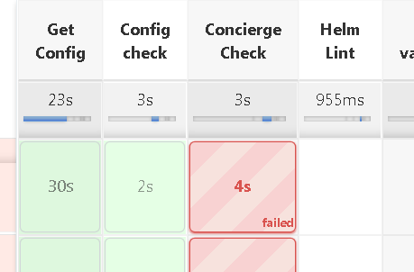
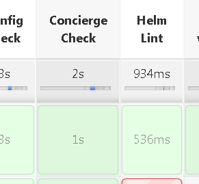
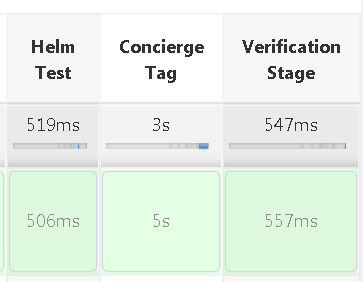

# Concierge integration

The 'concierge' step is a necesary step in the CD part of the pipeline. It will automaticaly be activated if an 'install' or a 'pre-install' are activated. 
In this step the concierge backend will be called to retrive the correct configuration for the installation process.
This step can fail for the following reason:

* No configuration was set on concierge.
* The envirment needs to be approved, in this case the pipeline would fail and a mail will be sent to all the PM's of the project with the all the istractions needed
* The particolar envirmanent (A) 'depends on' another envirment (B). This means that a succesfol installation on B is necesary to install on A

The last step of the pipeline will be a 'concierge tag' step. This is needed to notify concierge the deployment on a particolar envirment

## Configuration parameters 

### Main parameters
```yaml
concierge:
    label: LABEL
    tenantId: TENANT
    filter: [boolean or expression]
```
* **label**: this paramenter identifies the particolar envirment on concierge (tipicaly qa, prod, etc...)
* **tenantId**: this identify the tenant, if not defined is valued "DEFAULT"
* **filter**: This parameter can be used to activate/deactivate the concierge step (but if a CD installation phase is active concierge would be activated too, regardless of this field)

### Parameters to override artifact selection

All this parameters aren't usualy needed as the concierge step can derive then from other steps in the pipeline.

```yaml
    pomPath: POMPATH
    packageJsonPath: PACKAGEJSONPATH
    imageTag: IMAGETAG
    type: [MAVEN, NPM, DOCKER, YARN]
    release: [true, false]
```

These parameters can be useful to identify the artifact produced by the pipeline.

### Example

After having configured concierge with two environments:

* qa: this envirment is configured to be deployed with a helm chart on a kubernetes cluster
* prod: this envirment is also configured as kubernetes cluster. It depends on 'qa' and a cr must be filled on concierge to proced the installation

and having this *configuration-deploy-qa.yaml*

```yaml
docker:
  imageTag: "v1.7"

publish_artifact:
  tool: DOCKER
  release: true

concierge:
  label: qa

install:
    helm:
      chartResources:
        - path: "chart"
          values: 'chart/values.yaml'
env:
  - debug: true
  - requester: 'PJ466690-471165'
  - KEEP_WS: true
  - ENABLE_VERIFICATION: true
```
.

And this other pipeline for the file *configuration-deploy-prod.yaml* (it is suggested to use the [branch aware](./branch-aware.md) feature to manage differet envirment in the same project)

```yaml
concierge:
  label: prod

install:
    helm:
      chartResources:
        - path: "chart"
          values: 'chart/values.yaml'
          imageTag: "v1.7"
env:
  - debug: true
  - requester: 'PJ466690-471165'
  - KEEP_WS: true
  - ENABLE_VERIFICATION: true
```

If we try to run the **prod** pipeline this will be the result:



As you can see the concierge check failed, as it requires a prevision installation on qa.

So installing on qa we get:



This time the concierge check worked as we are allowed to install on qa.
And at the end of the pipeline we can see:



This 'tag' step means that a succesfull installation has been reported to concierge. In the same time this step generate an email sent to all of the project's PMs that contains a link to a concierge form usefull to set up all paraneters needed for a prod installation (cr and a time window for a valid installation)

Having done all this we can proceed to install on prod succesfuly
