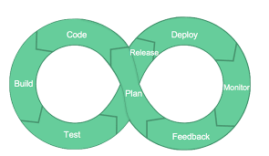

# DevOps project onboarding 🚢
Welcome! If you're here you are probably looking for a different, faster and better way of working with your projects.
Hopefully, together, we can turn this into the right place.

## Why you <u>need</u> a pipeline <small><small><small>(even if you don't know it yet)</small></small></small>
In case you're not completely familiar with the concept of "pipeline", let's share a common vision in order to know
what we're talking about.

### The good ol' way of shipping software to production 🐢
In the past the development phase was a very small part of the SDLC, and developers were not very accountable and
responsible for the product or functionality they were providing.
Implementing a functionality that honor (hopefully) some given requirement was an isolated step of the whole chain that
brought that particular functionality to the user/client/customer (call it whatever you want, that's not the point
here). Tons of other systems and professionals were part of this delivery process, with the result of losing the grip
on the overall picture.
The main pinpoints in this approach are slowness and rigidity.

Clearly that's an oversimplification, it's not that easy and straightforward, there's ton of literature about this if
you feel like to dig 📚.

### A new approach 📦🚚💨
Recently (well--"recently"), following the rediscovered consciousness given by the Agile world, a new stream of thoughts
has born: ✨**DevOps**✨.

The key, as per most of the Agile tools and practices, is the tightening of the feedback cycle.
Having a continuous iterative process, forcing us to focus on small improvements of the status quo, has been proven to
work particularly well, specially in complex environments.

As always, a picture is worth a thousand words.

[//]: # ()

  

Ideally, after a careful evaluation and a planning of the shared activity, each change to the code should trigger a 
whole new iteration of the process.
Each of the steps being part of the chain, besides the one identified here as `Plan`, can (and should) be automated
and performed almost without human intervention in order to avoid common pitfalls.
The point here is that humans fails more often than machines (at least when instructed properly 🙄).

Hence: **pipelines**!

A pipeline consists of a chain of processing elements, arranged so that the output of each element is the input of the
next one. In our context, besides the artifacts produced by each step could be very different from the one produced by
another one, are blockers in order of being able to proceed with the process.

Again, this is just for the sake of sharing a vision. Literature diggers can find as many references as they want just
googling.

## What you'll be provided with 🎁
Embracing this way of working you'll be provided with the essential to keep your project flows as it should be doing 🏄‍
and you'll have ✨**a new shiny pipeline**✨! Which is everything you've ever needed 😏
