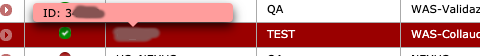

# Pipeline configuration
Since the content of the `devops/configuration.yaml` file is completely up to you, there are some ground rules to follow
to be the captain of your destiny! 
Just read through.

## Notifications
Specifying a notification key into your `configuration.yaml` you can customize how and which of the events generated by
Jenkins will be delivered to you.
### Mattermost
In order to get notified via *Mattermost* about events like the starting of a pipeline and its final state, you can
instruct Jenkins as follows:
```yaml
notifications:
  mattermost:
    channel: <INSERT HERE YOUR CHANNEL>
    token: <INSERT HERE YOUR TOKEN>
    triggers:
      - START
      - FAIL
      - FINISH
```
Using the `triggers` you can decide which events will fire a message on the *Mattermost* `channel` you decided.
!!! warning
    Be aware that the `channel` and `token` keys must be created beforehand.
    You will not be notified if that `channel` does not exist.
#### Generate Mattermost token
In order to generate a token that can be used in the pipeline to get notified in private channels the steps are:

* From Mattermost menu select Integrations
<p style="text-align: center">
    
</p>

* Select Incoming Webhook
<p style="text-align: center">
    
</p>

* Compile the fields and finally get the token to put in configuration.yaml
<p style="text-align: center">
    
</p>
 
### Mails
If you want to be notified via email you might want to specify the following in your `configuration.yaml`:
```yaml
notifications:
  mail:
    triggers:
      - START
      - FAIL
      - FINISH
    recipients: <my.email.1@unicredit.eu;my.email.2@unicredit.eu;...>
    recipientsProviders: CulpritsRecipientProvider
```
Using the `triggers` you can decide which events will fire an email to the `recipients` you provided.

Through the `recipientsProvider` you can also specify a strategy to send emails. Possible values are 

* `CulpritsRecipientProvider` - Sends email to the list of users who committed a change since the last non-broken build till now. This list at least always include people who made changes in this build, but if the previous build was a failure it also includes the culprit list from there.
* `DevelopersRecipientProvider` - Sends email to all the people who caused a change in the change set.
* `FailingTestSuspectsRecipientProvider` - Sends email to the list of users suspected of causing a unit test to begin failing. This list includes committers and requestors of the build where the test began to fail, and those for any consecutive failed builds prior to the build in which the test began to fail.
* `FirstFailingBuildSuspectsRecipientProvider` - Sends email to the list of users suspected of causing the build to begin failing.
* `RequesterRecipientProvider` - Sends email to the user who initiated the build.
* `UpstreamComitterRecipientProvider` - Sends email to the list of users who committed changes in upstream builds that triggered this build.


In order to enable mail notifications at least one configuration between `recipients` and `recipientsProvider` must be populated.  
In case that both keys are configured email will be sent to all the recipients configured and to all the members of the selected provider.

### Others
Currently (and officially) no other tools for sending notifications are available. If, for any reason, you need some
other tool (Slack, Office 365) to be included in this list, feel free to [get in touch](contribution-info.md).

## mlxInfo
With this configuration you can specify needed information required to use Gandalf installation.
```yaml
mlxInfo:
  application: EG0
  subsystem: EG0-CIT_JAVAWEB
```

!!! info
    - ```application``` must be the AAM code of your application
    - ```subsystem``` must be composed by the susbsystem and the subsystem type, separated by an underscore
    
    You can find both these info in the home page of [Gandalf GUI](http://gangui-us.intranet.unicredit.it/XA-GA3-PF/pages/index.jsf) 
    after selecting your application and subsystem.
    <p align="center">
      
    </p>
    
!!! warning
    To be able to install via Gandalf, there's an implicit constraint you must satisfy 
    in your ```pom.xml``` (the base ```pom.xml``` in case you have a modular project):
    
    - the ```groupId``` must be ```eu.unicredit[.xframe].<AAM CODE>```
    - the ```artifactId``` must be the subsystem name, **without** the subsystem type
    
            <groupId>eu.unicredit.xframe.eg0</groupId>
            <artifactId>EG0-CIT</artifactId>
    
## Available steps
The steps that follows are the available to you out of the box.
You cannot change their order, but you can modify a little their behaviour specifying some configuration for each of
them.

This is a handy summarized list. For details please refer to the following sections. 

| Step | Tools | Mandatory | Description |
| --- | --- | :-: | --- |
| Init                  | Git<br>SVN       | ✔ | Clone of the repository and executes initialization tasks | 
| Build                 | Maven<br>NPM<br>Yarn<br>Gradle         |   | Execute the build of the application together with the unit tests | 
| Dependency Check      |               | ✔ | Check whether the dependency used by the applications are safe to use or must be upgraded or substituted | 
| Sonar                 | Maven<br>NPM<br>Gradle<br>Sonar  | ✔ | Check the project for tests coverage and code quality | 
| Docker                 | Docker  |   | Allow to build and certify a docker image after static analysis and vulnerability checks | 
| Metadata Collect      |               |   | ??? | 
| Publish Artifact      | Maven<br>Nexus<br>Gradle  |   | Publish the application's artifact into Nexus |
| Role Check            ||✔| Check if the user who starts the build has permission to continue the pipeline execution|
| Get Artifact          |               |   | Downloads the artifact created for the application from Nexus | 
| Concierge Check(Coming Soon)              |      |   | A **mandatory** step to install. Calls concierge to check if the installation is allowed and properly configured and retrive this configuration for the preinstall/install steps| 
| Pre Install               | liquibase<br>flyway       |   | A step that can be used to prepare the deploy. Ex. update the database | 
| Install               | Helm<br>Gandalf<br>GCE       |   | Install your application through Helm, Gandalf, Google Compute Engine | 
| CD Integration Tests  | Maven<br>Newman      |   | Execute integration tests against the application in the higher environment | 
| e2e Tests             | Selenium, SoapUI |   | Execute end to end tests against the application in the higher environment | 
| Concierge Tag             | |   | Executed if an installation has taken place. Tag the resulted artifact and succesfuly deployed | 
### Init
This step is not configurable.

The purpose of this step is to clone the application's repository and perform some initialization required to run the
pipeline properly.

### Build
Execute the build of the application together with the unit tests.

If the build is executed by default also the Owasp Dependency Check (see [here](/troubleshooting/#how-to-suppress-a-owasp-dependency-check-false-positive-vulnerability) to suppress false positives) and the Sonar Scan stages will be executed

#### Maven
```yaml
build:
  maven:
    profiles: ''
    args: -U -Djavax.xml.accessExternalSchema=all -Djacoco.skip.instrument=false -DskipITs=true
    phase: package
    pomPath: path-to/pom.xml #Default pom.xml
```

#### Npm
```yaml
build:
  npm:
    command: run build:full
    args: -- --skip-tests
```
#### Gradle
```yaml
build:
  gradle:
    buildGradleFilePath: "."
    args: ""
    task: "build"
```

For further specific information, you can go [here](/specific-pipeline/#build-with-npm) for npm and [here](/build-with-gradle/#build-with-gradle) for gradle


### Sonar
Check the project for tests coverage and code quality.
This step is enabled by default if the build step is executed.

Following configuration can be omitted and by default will be used the following:

#### Maven
```yaml
sonar:
  maven:
    phase: sonar:sonar
```

#### Npm
```yaml
sonar:
  npm:
    command: run sonar-scanner
```  

#### Gradle
```yaml
sonar:
  gradle:
    task: sonarqube -x test
``` 

For further information about the usage of npm, you can go [here](/specific-pipeline/#build-with-npm)  

!!! warning
    Maven comes bundled with the sonar plugin, this means you won't have to add any explicit configuration when building with Maven.
    
    On the other hand, when building with npm the below configuration is mandatory, even if you rely on the implicit sonar stage:
    
    1. Add ```sonarqube-scanner``` to the dev dependencies by running:
    
            npm i sonarqube-scanner@^2.6.0 --save-dev
        
    1. Add this script to the ```package.json```:
    
            "sonar-scanner": "sonar-scanner"
        
    Indeed, this is the plugin used in the pipeline to analyze your code base. Without this, the pipeline will break.

### Docker
Allow building and certify a docker image after static analysis and vulnerability checks.  
Please, consider reading [this informations](pipeline-network-configuration.md) as the can be very useful.   

```yaml
docker:
  file: Docker/Dockerfile
  imageTag: value 
  buildArgs:
    - key: value
  
```

#### file
path of the Dockerfile to use.

#### imageTag _(Optional)_
tag the image with a specific tag

#### buildArgs _(Optional)_
Additional build args

### Publish Artifact
Publish the application's artifact into Nexus.
${POM_VERSION} variable can be used and it will be replaced with the maven pom version used for the build.

```yaml
publish_artifact:
  release: true|false 
  artifact: APP/myapp-${POM_VERSION}.war
  sideArtifact:
    - name: mysideartficat${POM_VERSION}.jar
      classifier: sources
```

#### artifact
The artifact name to publish. The variable ${POM_VERSION} can be used.

#### release
Possible values _`true`_ or _`false`_. Default value: _`false`_ 
If enabled the artifact will be published with the exact POM version.

#### sideArtifacts
A list of additional artifacts to publish. 

### Get Artifact
Downloads the artifact created for the application from Nexus

```yaml
get_artifact:
  nexus_api:
    mavenBaseVersion: 1.0.0
    mavenArtifactId: dummy-java-app
    mavenGroupId: eu.unicredit
    mavenExtension: war
```

### Concierge Check (Coming soon)
On this step Concierge will be call and if all checks turn positive the correct deployment configuration will be retrived

```yaml
concierge:
  label: qa
```
For more information you can go [here](/concierge)  

### Pre Install
A step that can be used to prepare the deploy. Ex. update the database  
liquibase or flyway can be used as tool on this stage.  

{!includes/base-additional-info.md!}
  
!!! danger
    This step of the pipeline is meant to be used in **non productive environment**.   
    If you tent to use it also within CD pipeline with deploy to production **you are fully responsible** to have a DB state backup, potential consequences and rollback.

#### Liquibase 
```yaml
pre_install:
  db_migrations:
    liquibase:
      commandParameters:
      command: update
      additionalOptions: 
      credentialsId: dbcred
      url: jdbc:oracle:thin:@<address>:<sid>
      driverClass: oracle.jdbc.OracleDriver # N.B. Driver lib configured to be downloaded in classPathArtifacts key
      classPathArtifacts: #NB. classPathArtifacts can be declared in both following ways
        - fqan: com.oracle.jdbc:ojdbc8:12.2.0.1.0
        - groupId: eu.unicredit.wep
          artifactId: liquibase-filters
          version: 1.0.1-RELEASE-master-2-2ff9134
      changeLogFile: sql-scripts/changelog-master.xml
```
For further info about liquibase you can follow this [url](https://www.liquibase.org/documentation/command_line.html)

#### Flyway 
```yaml
pre_install:
  db_migrations:
    flyway:
      config:
        - config_path: flyway/conf/flyway_devops_ddl.conf
          command: info
        - config_path: flyway/conf/flyway_devops_dml.conf
          command: info
```

### Install
Install the application on a target environment.
helm,gandalf,gce (Google compute engine) can be used as tool on this stage.  

{!includes/base-additional-info.md!}
* For **helm** usage be sure to grant namespace admin role to **`tujxpdepp01`** technical user and use **tujxpdepp01-openshift** as credentialsId

#### Gandalf
In order to be able to use gandalf the [mlxInfo](#mlxinfo) additional config must be added  

```yaml
install:
  gandalf:
    environmentName: <ENV NAME>
    deployTarget: <DEPLOY TARGET ID>
```

The deployTarget id can be retrieved in the Gandalf table shown in the following picture:  
  


#### Helm

```yaml
install:
  helm:
    chartResources:
      - path: "releative-path/to/mychart"
        cluster: clustername # reference the one defined in the application.yaml
        values: "relative-path/to/myvalues.yaml"
        imageTag: xx #OPTIONAL - If not specified, the one built in the previous step, will be used
        imageName: imageName #OPTIONAL - If not specified, the one built in the previous step, will be used
        releaseName: releasename #OPTIONAL
```

#### GCE
  
```yaml
install:
  gce:
    credentialsId: gce-technical-playground
    project: myproject
    instances:
      - myinstance
    additionalArgs: "--zone=europe-west4-a"
    artifact: # Optional - required in case you'd like to install specific version
      type: maven
      groupId: eu.unicredit.jxp
      artifactId: dummy-java-app
      extension: war
      version: 1.0.0-master-15-d9794b3
```

### CD Integration Tests

Runs integration tests against the application in the lower
  
{!includes/base-additional-info.md!}

#### SCM

SCM entry allows you to clone and run test from other repository

```yaml
integration_test_cd:
  scm:
    git:
      url: https://svn.internal.unicreditgroup.eu:18080/svn/THX_ARCHETYPE_LIB_JAVAWEB/tags/SoapUiTestingFramework/
      credentials_id:
      branch: master
  maven:
    args: -Denvironment=DEV -DendpointVar=https://agora-85-wiki.collaudo.usinet.it
    phase: test
```

#### Maven

Run Integration test using maven

```yaml
integration_test_cd:
  maven:
    args: -Denvironment=DEV -DendpointVar=https://agora-85-wiki.collaudo.usinet.it
    phase: test
```

#### Newman

Run Integration test using Postman/Newman

```yaml
integration_test_cd:
  newman:
    collections:
        - path: "newman/mycollection.json"
          options: --environment <source>
```

Additional newman options can be found [here](https://github.com/postmanlabs/newman#command-line-options)

### e2e Tests

{!includes/base-additional-info.md!}  

```yaml
e2e_test_cd:
  scm:
    svn:
      url: https://svn.internal.unicreditgroup.eu:18080/svn/THX_ARCHETYPE_LIB_JAVAWEB/tags/EG0-JTAF/eg0
  maven:
    args: -DenvironmentUnderTest=UAT -DseleniumGridURL=http://10.58.171.48/wd/hub/ -Dremote=true
    phase: test
```

## Skip a step - filter

Each of the default steps can be disabled using a property called `filter`.
In order to skip a step for all the builds you can set this property to `false`.

If you need just to skip a step on a particular occasion you have a simple DSL that you can use to write common
conditions.
Variables that you can use in your expressions are

| Variable name | Description |
| --- | --- |
| BRANCH | The branch of the project that you're building |
| BUILD_CAUSE | One of self-explanatory: `USER`, `SCM`, `TIMER`, `GENERIC` |
| HOUR | The current hour of the day in the 24H format |
| MINUTE | The current minutes withing the hour |
| env.* | All the environment variables available during the pipeline |

and you can use the following operators (which you can find described 
[here](http://docs.groovy-lang.org/docs/next/html/documentation/core-operators.html))

| Operator | Description |
| --- | --- |
| `is` or `=` or `==` | Equality operator |
| `isnot` or `!=` | Disequality operator |
| `and` or `&&` | Logical conjunction operator |
| `or` or `||` | Logical disjunction operator |
| `like` or `==~` | [Match operator](http://docs.groovy-lang.org/docs/next/html/documentation/core-operators.html#_match_operator) |

For example, in case you want to disable the `publish_artifact` on manually user started pipelines, you could write

```yaml
publish_artifact:
  artifact: APP/myapp.war
  filter: BUILD_CAUSE isnot "USER"
```

or

```yaml
publish_artifact:
  artifact: APP/myapp.war
  filter: BRANCH is "release" and $BUILD_CAUSE isnot "USER"
```

or if you prefer to use regex in order to filter:

```yaml
publish_artifact:
  artifact: APP/myapp.war
  filter: BRANCH like /release\/.*/ or BRANCH is 'master' # This filter will enable this step in all the branches release/* or in branch master
```

!!! warning
    The escape \ char inside the start / and the end / of the regex.

## Environment variables

If you need a way to pass some environment variable to some step

```yaml
env:
  - ENV_VARIABLE1: VALUE1
  - ENV_VARIABLE2: VALUE2
  ...
```


[]: https://github.com/postmanlabs/newman#command-line-options