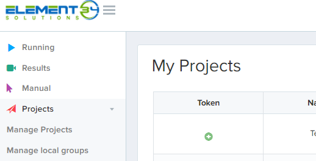

# Selenium Grid

## What is Selenium?

Selenium is an open-source, portable framework for testing web applications. Selenium WebDriver allows you to write tests in a number of popular programming languages, including C#, Groovy, Java, Perl, PHP, Python, Ruby and Scala. The tests can then run against most modern web browsers (I.E. 11, Chrome, Firefox).

With Selenium Grid, one server acts as the hub. Tests through the hub obtain access to browser instances. The hub has a list of servers that provide access to browser instances (WebDriver nodes), and lets tests use these instances. Selenium Grid allows running tests in parallel on multiple machines and to manage different browser versions and configurations centrally (instead of using client side browser instances).

The ability to run tests on remote browser instances is useful to spread the load of testing across several machines and to run tests in browsers running on different platforms or operating systems. The latter is particularly useful in cases where not all browsers to be used for testing can run on the same platform.

## SeleniumBox – Enterprise Selenium Grid

Selenium Box (SBox) is an Enterprise Selenium Grid solution running inside the corporate network on our infrastructure.

It provides a secure, highly scalable and maintenance free Selenium Grid environment. Selenium Box allows development teams to be able to fully focus on writing, executing and analyzing Selenium tests, without having to spend resources on building, maintaining and operating a Selenium Grid infrastructure.

Tests can run on a variety of browsers (no Safari support) and versions. They are separated having their own execution environment, avoiding interference between them. Selenium Box implements the standard WebDriver protocol. The same Selenium tests executed on local environment can run also on Selenium Box without code changes.

The features for all the profiles (LDAP groups) are the same:

- You can choose to see automatic tests running – **Running** menu
- You can see previous runs with the corresponding video recordings (capability _e34:video_ should be set to true) – **Results** menu
- You can start a manual test session – **Manual** menu
- No reporting can be found here it's an execution platform only

!!! info
    In order to run your test automation suite, you will need the **token** corresponding to the project. You can generate it accessing following self service page [https://sbox.internal.unicreditgroup.eu/ui/test-projects/selfservice](https://sbox.internal.unicreditgroup.eu/ui/test-projects/selfservice) and clicking a small green plus sign (+).
    <p style="text-align: center">
        
    </p>

You should include this token in the desired Selenium Capabilities, like so:

```java
options.setCapability(“e34:token”, “966c10g3-4c67-44”);
```

If you want more information about Selenium Box take a look here: [https://sbox.internal.unicreditgroup.eu/ui/documentation](https://sbox.internal.unicreditgroup.eu/ui/documentation)

## How to request access to SeleniumBox

To have a full access to the tool 

1. You need to be sure LDAP groups like below exists for your application

    - JYYXXX_DEVOPS_PM[^1]
    - JYYXXX_DEVOPS_DEV[^1]
    - JYYXXX_DEVOPS_GUEST[^1]

    if not follow the [guide](https://onboarding.devops.internal.unicreditgroup.eu/prerequisites/#ldap) to create them.

1. Ask for a provisioning using Ticket Online please follow dropdown menu *[Developer Topics -> Selenium Grid -> Onboarding request](https://webappars.intranet.unicreditgroup.eu/arsys/servlet/ViewFormServlet?form=UGIS:Global:TroubleTicket&view=GlobalBranchView_en&server=ars&mode=Submit&F536871059=59419)*

    Possibly in the request specify Business Area of the application (where it is structured in the company)

1. After a successfull provisionig, please check if your website is visible from SBox from the networking point of view.

- Log in to [SBox](https://sbox.internal.unicreditgroup.eu/ui/login) and go to [**Manual** menu](https://sbox.internal.unicreditgroup.eu/ui/manual)
- Start a manual test with your web site
- check if your site is rendered as expected

In case not please open a **tufin request** from the SBox executors subnet to your web site as detailed [here](selenium/e2e-test-selenium/#firewall-rules).

## How to use resources behind a proxy

Sometimes your application is using a resources from internet like ex. fonts from fonts.google.com
or when you want to test application based on sharepoint online you need to access to resources from *.sharepoint.com

Some necessary domains are already whitelisted on the application proxy and can be reached by using it with following capability: 

| capability | value |
|---|---|
| proxy	| { "httpProxy":"applicationproxy.internal.unicredit.eu:8080", "proxyType":"MANUAL", "sslProxy":"applicationproxy.internal.unicredit.eu:8080" } |

ex.
```java
options.setCapability(“proxy”, “{ "httpProxy":"applicationproxy.internal.unicredit.eu:8080", "proxyType":"MANUAL", "sslProxy":"applicationproxy.internal.unicredit.eu:8080" }”);
```
it can be used also during manual test session.

If you have nacessity to add a reasonable domain to whitelist, please contact us as usual: [Support request for SeleniumBox](https://onboarding.devops.internal.unicreditgroup.eu/support/#support-request)


## F.A.Q. SeleniumBox

### Q: Where I can find a manual?

A: Please check on [https://sbox.internal.unicreditgroup.eu/docs/writing-tests/](https://sbox.internal.unicreditgroup.eu/docs/writing-tests/)

### Q: I cannot see any project on SBox web interface but the test is executing, what’s wrong?

A: Please check on UniKey if your user has one of the profiles simiral to _JUSXXX_DEVOPS_YYYYY_, if no please request one.

### Q: How I can use Sbox to do a manual test?

A: Click on menu a “Manual” or follow the link https://sbox.internal.unicreditgroup.eu/ui/manual , after quick selecton of the web browser version you can start your manual test.

### Q: While executing the test I have following error: _javax.net.ssl.SSLHandshakeException: sun.security.validator.ValidatorException: PKIX path building failed: sun.security.provider.certpath.SunCertPathBuilderException: unable to find valid certification path to requested target_

A: The problem is caused by missing UniCredit root SSL certificate in your cacerts file of java jdk. You can substitute your cacerts with one you can download from [here](https://onboarding.devops.internal.unicreditgroup.eu/files/cacerts). It contains Unicredit Root e UniCredit Subordinate N1, N2, N3 certificates. You find it inside JDK folder ex. C:\Program Files\Java\jdk1.8.0\jre\lib\security or similar. If you don’t have admin rights you can launch tests indicating different cacerts as following:
clean test -Djavax.net.ssl.trustStore=/another/path/to/cacerts -Djavax.net.debug=ssl:handshake -f pom.xml
where last cacerts indicates cacerts file.

### Q: When I open a https url with selenium using Internet Explorer (IE) browser, I get a security warning about insecure certificate.

A: With SeleniumBox you can skip this warning by accepting insecure certs as a driver capability also for IE. Please add a following driver capability interpreted by SeleniumBox to solve the issue:
e34:acceptInsecureCerts = true

[^1]:Please note that `YY`, in the previous LDAP group names should be your Legal entity id (US, XL, ...) and `XXX` should be [AAM code](troubleshooting.md#-where-can-i-get-the-aam-of-my-application)